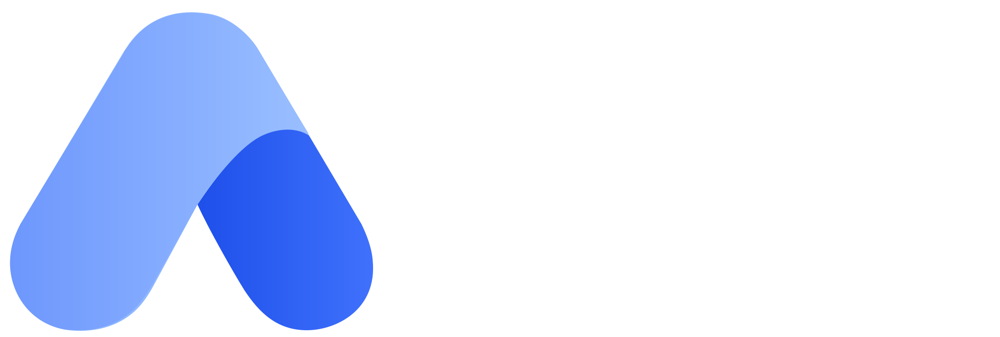

### Sua clínica, sua agenda e seu prontuário em um só lugar.

Plataforma completa de medicina moderna — **Developers First**.

---

## O que é a Aliv

A **Aliv Saúde** é um SaaS de gestão clínica que reúne, num só lugar, tudo que uma clínica precisa para operar: agendamento inteligente, prontuário eletrônico, teleconsulta, prescrição com catálogo oficial, exames com OCR e financeiro integrado.

Construímos a plataforma com contratos de API claros e documentados (OpenAPI/Swagger), porque acreditamos que software de saúde bom nasce de bases sólidas para quem o constrói.

## O que a plataforma faz

- **Agendamento com wizard completo** — convênio, consulta ou exame, presencial ou online, recorrência e pagamento no mesmo fluxo.
- **Prontuário e triagem** — histórico clínico, alergias e evolução do paciente.
- **Teleconsulta** — vídeo, chat e tokens assinados via LiveKit (WebRTC self-hosted).
- **Prescrição oficial** — receitas com catálogo CMED/ANVISA, preços e bulas oficiais.
- **Exames com OCR** — leitura automática de laudos (PaddleOCR + PyMuPDF).
- **Atestados e documentos** — geração em PDF.
- **Financeiro** — gateway de pagamento (PIX, boleto e cartão) com webhooks por evento de domínio.
- **Notificações** — disparadas por eventos de domínio.

## Stack

| Camada | Tecnologia |
|---|---|
| **Backend** | Java 21 · Spring Boot 4 (Web MVC, Security + JWT, Data JPA, Flyway) · OpenPDF · springdoc |
| **Banco / Storage** | PostgreSQL 16 · GCS (fake-gcs em dev) |
| **Teleconsulta** | LiveKit self-hosted (SFU WebRTC) |
| **Pagamentos** | AbacatePay (API v2) — PIX, boleto e cartão + webhooks |
| **Front** | SPA (referência vanilla → reescrita em React) |
| **Serviços Python/Node** | FastAPI (bulas, OCR) · Node (bulário ANVISA) |
| **Dados públicos** | CMED, CID-10, ANVISA (medicamentos, bulas, VigiMed) |

## Repositórios

| Repo | Descrição |
|---|---|
| **Core** | Monorepo da plataforma — backend, front e serviços auxiliares. |
| **OHIF-Custom** | Visualizador DICOM customizado (fork do OHIF Viewers). |

## Contato

Interessado na plataforma ou em contribuir? Abra uma issue nos nossos repositórios.

© Aliv Saúde — medicina moderna, feita para quem constrói.

